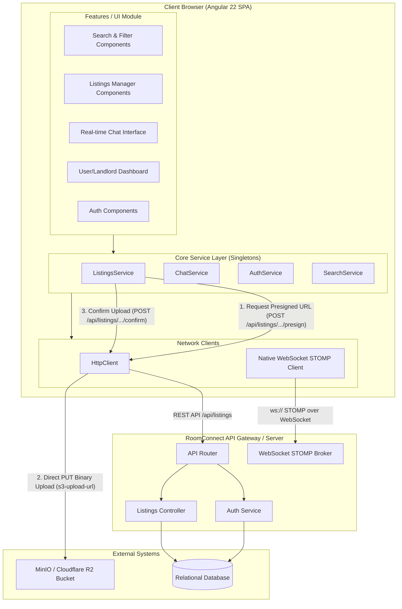

# RoomConnect Web Frontend

RoomConnect is a modern, premium room rental and roommate matching platform. The frontend web application is built on the state-of-the-art **Angular 22** framework, utilizing modern TypeScript 6.x, Vitest for testing, and a highly responsive design tailored for tenants and landlords.

---

## 🏗️ System Design & Architecture

The application is structured as a Single Page Application (SPA) leveraging modular architecture. It segregates logic into specialized feature modules, unified core services, and a direct S3/MinIO upload pipeline to ensure high performance and loose coupling.

### System Architecture Diagram



### Key System Design Highlights

#### 1. Zero-Dependency STOMP over WebSocket Client
The chat module implements a **lightweight, native STOMP client** constructed directly on top of the browser's standard WebSocket API, removing heavy dependencies like `stompjs` or `sockjs-client`.
*   **Heartbeats & Handshakes**: Custom logic sends raw text-based `CONNECT`, `SUBSCRIBE`, and `SEND` STOMP frames over the socket.
*   **Resiliency**: Incorporates a built-in automated reconnect loop that triggers reconnection every 5 seconds on disconnect.
*   **Dynamic Subscription Manager**: Active chat windows dynamically register callback handlers keyed by STOMP subscription IDs.

#### 2. Decentralized High-Performance Media Upload Pipeline
To prevent backend servers from becoming performance bottlenecks when users upload high-resolution listing photos, RoomConnect uses a decentralized presigned-upload pipeline:
*   **Presigned Query**: The frontend queries the backend API (`/api/listings/.../media/presign`) to request a secure upload URL.
*   **Direct-to-S3 Upload**: The frontend performs a direct binary `PUT` request containing the raw file to the storage provider (MinIO / Cloudflare R2 / AWS S3) via the returned presigned URL.
*   **State Confirmation**: Once the S3 transfer finishes, the frontend contacts the backend API (`/confirm`) to register the media ID and activate the listing images.

#### 3. Loose-Coupling with Feature-Based Folder Structure
The codebase follows a strictly modular folder structure to enforce clean boundaries:
*   `core/`: Core singletons, HTTP interceptors, global guard structures, and central API client wrappers.
*   `features/`: Self-contained business modules (Admin panel, Authentication, Dashboard, Listings management, Chat room, Search & Filters).

---

## 🛠️ Tech Stack

| Technology | Purpose | Notes |
| :--- | :--- | :--- |
| **Angular 22.0.0** | Frontend Framework | Standalone components, modern Signals, and Router API. |
| **TypeScript 6.0** | Programming Language | Enterprise-grade strong typing. |
| **Vitest 4.0** | Unit Testing | Replaces Karma with a blazing-fast ESM-based test runner. |
| **Vite Dev Server** | Local Bundling & Serve | Integrated via Angular Build CLI for fast Hot Module Replacement. |
| **TailwindCSS / Vanilla CSS** | Styling System | Modern UI styling, custom variables, and responsive grids. |
| **WebSocket / STOMP** | Real-Time Messaging | Direct communication engine for tenant-landlord chats. |
| **Vercel** | SPA Hosting Platform | Production deployment and URL path rewrites. |

---

## 📂 Project Structure

```
roomconnect-web/
├── src/
│   ├── index.html           # Main SPA template HTML
│   ├── main.ts              # App bootstrap file
│   ├── styles.css           # Global application styles
│   └── app/
│       ├── app.config.ts    # Providers config (routing, HTTP clients)
│       ├── app.routes.ts    # Application routing definitions
│       ├── app.ts           # Root component (app-root)
│       ├── core/            # Global singletons & services
│       │   ├── auth/        # Core authentication guards/interceptors
│       │   ├── components/  # Universal components (alerts, loaders)
│       │   └── services/    # Global API connection utilities (Chat, Listings, etc.)
│       └── features/        # Business feature modules
│           ├── admin/       # Landlord/listing moderation
│           ├── auth/        # Login/register user interface
│           ├── chat/        # WebSocket chat client UI
│           ├── dashboard/   # Personal user console & booked tours
│           ├── listings/    # Listing creation, updates, and uploads
│           └── search/      # Search page with criteria filter lists
├── angular.json             # Angular workspace configuration
├── tsconfig.json            # TypeScript compiler configuration
├── vercel.json              # Vercel configuration (for routing rewrites)
├── package.json             # Package scripts & dependencies
└── .gitignore               # Exclusions for repositories & GitHub
```

---

## 🚀 Getting Started

### Prerequisites
Make sure you have Node.js installed (v18 or higher is recommended) and the package manager ready.

```bash
# Check version
node -v
npm -v
```

### Installation
Clone the project and install all dependencies:

```bash
npm install
```

### Running the Development Server
Run the local development server:

```bash
npm start
```
*   The application will be served at `http://localhost:4200/`.
*   Hot module replacement (HMR) will trigger automatically upon saving any code file.

### Building for Production
To build the static application bundle:

```bash
npm run build
```
This generates compile-optimized static bundles inside the `dist/` directory.

### Running Unit Tests
To execute unit tests using Vitest:

```bash
npm run test
```

---

## ☁️ Deployment (Vercel)

This application is ready to be deployed on Vercel. 

The `vercel.json` file contains URL rewrite rules to enable standard Single Page Application routing. In SPA architectures, navigating directly to path-based routes (e.g., `/dashboard`) will result in a 404 error if refreshed; Vercel rewrites solve this by mapping all wildcard incoming paths back to `/index.html`:

```json
{
  "rewrites": [
    { "source": "/(.*)", "destination": "/index.html" }
  ]
}
```
